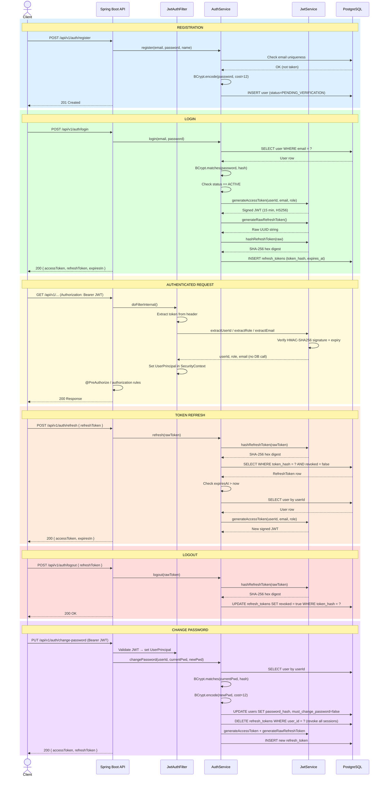

# Security & Authentication — Backend Reference

This document describes the complete security and authentication implementation of the Barangay Clearance System backend. It covers token strategy, filter chain, role-based access, password handling, session management, CORS policy, and the no-auth development profile.

---

## Table of Contents

1. [Overview](#1-overview)
2. [User Model & Roles](#2-user-model--roles)
3. [Password Handling](#3-password-handling)
4. [JWT Strategy](#4-jwt-strategy)
5. [Refresh Token Strategy](#5-refresh-token-strategy)
6. [Authentication Filter — JwtAuthFilter](#6-authentication-filter--jwtauthfilter)
7. [UserPrincipal](#7-userprincipal)
8. [Spring Security Filter Chain — SecurityConfig](#8-spring-security-filter-chain--securityconfig)
9. [Method-Level Authorization](#9-method-level-authorization)
10. [Auth API Endpoints](#10-auth-api-endpoints)
11. [Auth Flow Diagrams](#11-auth-flow-diagrams)
12. [Error Responses](#12-error-responses)
13. [CORS Configuration](#13-cors-configuration)
14. [No-Auth Profile (LocalSecurityConfig)](#14-no-auth-profile-localsecurityconfig)
15. [Configuration Reference](#15-configuration-reference)
16. [Security Considerations](#16-security-considerations)

---

## 1. Overview

The backend uses **stateless JWT authentication** built on Spring Security 6. There is no HTTP session state — every request must carry a self-contained signed access token. The overall token design is:

| Token         | Type                                 | Storage                                | Lifetime (default) |
| ------------- | ------------------------------------ | -------------------------------------- | ------------------ |
| Access token  | Signed JWT (HMAC-SHA256)             | Client memory / `Authorization` header | 15 minutes         |
| Refresh token | Opaque UUID (only hash stored in DB) | Client storage / request body          | 7 days             |

This separation means:

- The access token is **verified purely by its signature** on every request — no database roundtrip.
- The refresh token **requires a database lookup** (by its SHA-256 hash) and can be individually revoked.

---

## 2. User Model & Roles

**Entity:** `com.barangay.clearance.identity.entity.User`  
**Table:** `users`

### Roles

Defined as `User.Role` (stored as a `VARCHAR` column):

| Role       | Description                                          |
| ---------- | ---------------------------------------------------- |
| `RESIDENT` | Portal user; can submit and track clearance requests |
| `CLERK`    | Back-office staff; processes and manages requests    |
| `APPROVER` | Back-office staff; approves or rejects requests      |
| `ADMIN`    | Full back-office access including user management    |

A user has exactly one role. Roles are embedded as a claim inside the JWT access token.

### Account Statuses

Defined as `User.UserStatus`:

| Status                 | Description                                      |
| ---------------------- | ------------------------------------------------ |
| `ACTIVE`               | Normal, can log in                               |
| `INACTIVE`             | Soft-disabled                                    |
| `PENDING_VERIFICATION` | Newly registered resident; awaits staff approval |
| `REJECTED`             | Registration was rejected by staff               |
| `DEACTIVATED`          | Explicitly deactivated by an admin               |

Login is blocked for all statuses except `ACTIVE`. Each non-active status returns a distinct `403 Forbidden` message.

### Key Fields

```
id                UUID (PK, auto-generated)
email             VARCHAR(255) UNIQUE NOT NULL
password_hash     VARCHAR(255) NOT NULL          -- BCrypt
first_name        VARCHAR(100) NOT NULL
last_name         VARCHAR(100) NOT NULL
role              VARCHAR(20) NOT NULL
status            VARCHAR(20) NOT NULL
must_change_password  BOOLEAN NOT NULL DEFAULT false
created_at        TIMESTAMP
updated_at        TIMESTAMP
```

The `must_change_password` flag is set to `true` on admin-created staff accounts and embedded in the access token claim. Frontend middleware enforces a redirect to the change-password screen when this flag is set.

---

## 3. Password Handling

**Encoder:** `BCryptPasswordEncoder` with a **cost factor of 12**.

```java
// SecurityConfig.java
@Bean
public PasswordEncoder passwordEncoder() {
    return new BCryptPasswordEncoder(12);
}
```

- Passwords are hashed before persistence using `passwordEncoder.encode(...)`.
- Verification uses `passwordEncoder.matches(rawPassword, storedHash)`.
- **Plain-text passwords are never logged or stored.**
- On password change, all existing refresh tokens for the user are deleted (`refreshTokenRepository.deleteByUserId(userId)`), forcing re-authentication on all devices.

---

## 4. JWT Strategy

**Library:** JJWT 0.12.x  
**Algorithm:** HMAC-SHA256 (`HS256`)  
**Service:** `com.barangay.clearance.identity.service.JwtService`

### Signing Key

The secret is loaded from `app.jwt.secret` (application properties). The key is derived using:

```java
Keys.hmacShaKeyFor(secret.getBytes(StandardCharsets.UTF_8))
```

For production, `JWT_SECRET` must be supplied as an environment variable. The secret must be **at least 256 bits (32 characters)** for HS256.

### Access Token Claims

| Claim                | Type    | Value                                       |
| -------------------- | ------- | ------------------------------------------- |
| `sub`                | String  | User UUID                                   |
| `email`              | String  | User e-mail address                         |
| `role`               | String  | `ADMIN`, `CLERK`, `APPROVER`, or `RESIDENT` |
| `mustChangePassword` | Boolean | Whether the user must change their password |
| `iat`                | Date    | Token issuance time                         |
| `exp`                | Date    | Token expiry time                           |

### Token Generation

```java
Jwts.builder()
    .subject(userId.toString())
    .claim("email", email)
    .claim("role", role.name())
    .claim("mustChangePassword", mustChangePassword)
    .issuedAt(Date.from(now))
    .expiration(Date.from(now.plusMillis(accessTokenExpiryMs)))
    .signWith(signingKey)
    .compact();
```

### Token Validation

Claims are extracted via `Jwts.parser().verifyWith(signingKey).build().parseSignedClaims(token)`. JJWT automatically validates the signature and expiry. Any validation failure throws a `JwtException`, which the filter catches and handles gracefully.

---

## 5. Refresh Token Strategy

**Entity:** `com.barangay.clearance.identity.entity.RefreshToken`  
**Table:** `refresh_tokens`

Refresh tokens are **opaque random UUIDs**. Only the SHA-256 hash of the raw token is persisted — the raw value is never stored.

### Lifecycle

1. **Issue:** On successful login, `UUID.randomUUID().toString()` generates the raw token; `JwtService.hashRefreshToken(raw)` computes the SHA-256 hex digest that is stored in the DB.
2. **Return:** The **raw** token is returned to the client in the login response. The client is responsible for secure storage.
3. **Refresh:** Client POSTs the raw token; server hashes it and looks it up in the DB, then issues a new access token.
4. **Revoke (logout):** Server hashes the token, finds the record, sets `revoked = true`.
5. **Expiry:** `expiresAt` is checked on every refresh attempt.
6. **Rotation on password change:** All refresh tokens for the user are hard-deleted when the password is changed.

### Schema

```
id           UUID (PK)
user_id      UUID NOT NULL  -- references users.id (logical FK, no JPA relation)
token_hash   VARCHAR(64) UNIQUE NOT NULL  -- SHA-256 hex
expires_at   TIMESTAMP NOT NULL
revoked      BOOLEAN NOT NULL DEFAULT false
created_at   TIMESTAMP
```

---

## 6. Authentication Filter — JwtAuthFilter

**Class:** `com.barangay.clearance.shared.security.JwtAuthFilter`  
**Extends:** `OncePerRequestFilter`  
**Active on:** `!no-auth` Spring profile

### Processing Steps

```
HTTP Request
    │
    ▼
Extract "Authorization" header
    │  missing or not "Bearer …"?  → pass through (anonymous)
    ▼
Strip "Bearer " prefix → raw JWT string
    │
    ▼
JwtService.extractUserId(token)   ─┐
JwtService.extractRole(token)      ├─ all three throw JwtException on failure
JwtService.extractEmail(token)    ─┘
    │
    ▼
Construct UserPrincipal(userId, email, role)
    │
    ▼
Set UsernamePasswordAuthenticationToken on SecurityContextHolder
    │
    ▼
Continue filter chain
```

If JWT validation fails, the `SecurityContextHolder` is cleared and the request continues **without authentication** — the downstream authorization rules then reject it with `401 Unauthorized`. The filter itself never writes to the response.

**No database lookup occurs in this filter.** Authentication is derived entirely from the token signature and claims.

---

## 7. UserPrincipal

**Class:** `com.barangay.clearance.shared.security.UserPrincipal`  
**Implements:** `org.springframework.security.core.userdetails.UserDetails`

`UserPrincipal` is the authenticated principal object placed in the `SecurityContext`. It carries:

| Field         | Type                           | Source                                                |
| ------------- | ------------------------------ | ----------------------------------------------------- |
| `userId`      | `UUID`                         | JWT `sub` claim                                       |
| `email`       | `String`                       | JWT `email` claim                                     |
| `role`        | `User.Role`                    | JWT `role` claim                                      |
| `authorities` | `Collection<GrantedAuthority>` | `List.of(new SimpleGrantedAuthority("ROLE_" + role))` |

Controllers can inject the current principal with `@AuthenticationPrincipal UserPrincipal principal`.

---

## 8. Spring Security Filter Chain — SecurityConfig

**Class:** `com.barangay.clearance.shared.security.SecurityConfig`  
**Active on:** `!no-auth` Spring profile

### Configuration Summary

| Setting                            | Value                           |
| ---------------------------------- | ------------------------------- |
| Session management                 | `STATELESS` — no HTTP sessions  |
| CSRF                               | Disabled (REST API; JWT-based)  |
| CORS                               | Enabled (see Section 13)        |
| Default authentication entry point | Returns JSON `401 Unauthorized` |
| Default access-denied handler      | Returns JSON `403 Forbidden`    |

### Public Paths (no token required)

```
/api/v1/auth/**
/swagger-ui/**
/swagger-ui.html
/v3/api-docs/**
/actuator/health
```

All other paths require a valid, non-expired JWT.

### Filter Order

`JwtAuthFilter` is inserted **before** `UsernamePasswordAuthenticationFilter`:

```
... → JwtAuthFilter → UsernamePasswordAuthenticationFilter → ...
```

---

## 9. Method-Level Authorization

`@EnableMethodSecurity` is active on `SecurityConfig`, enabling `@PreAuthorize` annotations.

### Usage Patterns

**Controller-level (all methods):**

```java
@PreAuthorize("hasRole('ADMIN')")
public class UserController { ... }
```

**Method-level:**

```java
@PreAuthorize("hasRole('ADMIN') or hasRole('CLERK')")
public ResponseEntity<...> someEndpoint(...) { ... }
```

Spring Security translates `hasRole('ADMIN')` to `ROLE_ADMIN` by convention, matching the `"ROLE_" + role.name()` authority string set in `UserPrincipal`.

### Role Matrix (current)

| Endpoint Group                             | RESIDENT   | CLERK | APPROVER | ADMIN |
| ------------------------------------------ | ---------- | ----- | -------- | ----- |
| `POST /api/v1/auth/**`                     | ✓ (public) | ✓     | ✓        | ✓     |
| Resident portal (`/api/v1/portal/**`)      | ✓          | —     | —        | —     |
| Back-office clearances                     | —          | ✓     | ✓        | ✓     |
| Admin user management (`/api/v1/admin/**`) | —          | —     | —        | ✓     |

---

## 10. Auth API Endpoints

Base path: `/api/v1/auth`

### POST `/register`

Create a new resident account. Account status is set to `PENDING_VERIFICATION`.

**Request:**

```json
{
  "email": "juan@example.com",
  "password": "SecurePass1!",
  "firstName": "Juan",
  "lastName": "dela Cruz"
}
```

**Response:** `201 Created` (no body)

---

### POST `/login`

Authenticate and receive tokens.

**Request:**

```json
{
  "email": "juan@example.com",
  "password": "SecurePass1!"
}
```

**Response:** `200 OK`

```json
{
  "accessToken": "<JWT>",
  "refreshToken": "<opaque-uuid>",
  "tokenType": "Bearer",
  "expiresIn": 900,
  "mustChangePassword": null
}
```

`mustChangePassword` is `true` (not `null`) when the user must update their password before proceeding.

---

### POST `/refresh`

Obtain a new access token using a valid refresh token.

**Request:**

```json
{
  "refreshToken": "<opaque-uuid>"
}
```

**Response:** `200 OK`

```json
{
  "accessToken": "<new-JWT>",
  "tokenType": "Bearer",
  "expiresIn": 900
}
```

---

### POST `/logout`

Revoke the refresh token.

**Request:**

```json
{
  "refreshToken": "<opaque-uuid>"
}
```

**Response:** `200 OK` (no body)

---

### PUT `/change-password`

Change password for the currently authenticated user. Requires a valid access token. Revokes all existing refresh tokens and issues a new access + refresh token pair.

**Headers:** `Authorization: Bearer <access-token>`

**Request:**

```json
{
  "currentPassword": "OldPass1!",
  "newPassword": "NewPass1!"
}
```

**Response:** `200 OK` — new token pair (same shape as `/login` response).

---

## 11. Auth Flow Diagrams

The diagram below covers all six auth flows end-to-end, showing every actor and database interaction.



---

### Process Flow Walkthrough

The following describes each authentication flow step by step as it moves through the application layers.

---

#### 1. Registration

A new user submits their details to create a resident account.

1. Client sends `POST /api/v1/auth/register` with `email`, `password`, `firstName`, and `lastName`.
2. `AuthService.register()` checks whether the email already exists in the `users` table. If a duplicate is found, a `409 Conflict` is returned immediately.
3. The raw password is hashed using **BCrypt with cost factor 12**.
4. A new `User` row is persisted with `role = RESIDENT` and `status = PENDING_VERIFICATION`. The account cannot be used until a staff member approves it and upgrades the status to `ACTIVE`.
5. The API returns `201 Created` with no body.

> Staff use the back-office to review pending registrations and manually set the status to `ACTIVE` or `REJECTED`.

---

#### 2. Login

An existing user authenticates and receives a usable token pair.

1. Client sends `POST /api/v1/auth/login` with `email` and `password`.
2. `AuthService.login()` queries the `users` table by email. If no match is found, a generic `401 Unauthorized` is returned (same message for wrong password — prevents user enumeration).
3. `BCryptPasswordEncoder.matches()` compares the submitted password against the stored hash.
4. The user's `status` is checked. Any status other than `ACTIVE` returns `403 Forbidden` with a descriptive message (`PENDING_VERIFICATION`, `REJECTED`, `DEACTIVATED`, `INACTIVE`).
5. `JwtService.generateAccessToken()` builds a signed **HS256 JWT** containing `userId`, `email`, `role`, and `mustChangePassword` claims with a **15-minute expiry**.
6. `JwtService.generateRawRefreshToken()` creates a random **UUID string** (never stored as-is).
7. `JwtService.hashRefreshToken()` computes the **SHA-256 hex digest** of the raw UUID.
8. The hash and expiry (`now + 7 days`) are inserted into the `refresh_tokens` table.
9. The API returns `200 OK` with `{ accessToken, refreshToken, tokenType, expiresIn }`. The `refreshToken` field contains the **raw UUID** — the client is responsible for storing it securely.

---

#### 3. Authenticated Request

Every protected API call is validated by `JwtAuthFilter` before reaching any controller.

1. The client attaches the access token as `Authorization: Bearer <JWT>`.
2. `JwtAuthFilter.doFilterInternal()` runs exactly once per request (`OncePerRequestFilter`).
3. The `Authorization` header is read. If it is absent or does not start with `"Bearer "`, the filter passes the request through unauthenticated — downstream security rules will reject it with `401`.
4. The `"Bearer "` prefix is stripped and the raw JWT string is passed to `JwtService`.
5. `JwtService` calls `Jwts.parser().verifyWith(signingKey).build().parseSignedClaims(token)`. This simultaneously verifies the **HMAC-SHA256 signature** and checks the **expiry (`exp`) claim**. No database call is made.
6. On success, `userId`, `role`, and `email` are extracted from the claims and wrapped in a `UserPrincipal` object.
7. A `UsernamePasswordAuthenticationToken` carrying the `UserPrincipal` is placed in the `SecurityContextHolder`.
8. If JWT validation throws a `JwtException` (bad signature, expired, malformed), the `SecurityContextHolder` is cleared and the request continues without authentication.
9. Spring Security's authorization rules then evaluate the request. Unauthenticated requests to protected paths return `401`; requests with insufficient role return `403`.

---

#### 4. Token Refresh

Used when the access token expires but the refresh token is still valid.

1. Client sends `POST /api/v1/auth/refresh` with `{ refreshToken: "<raw-uuid>" }`.
2. `AuthService.refresh()` hashes the received token with SHA-256.
3. The hash is looked up in the `refresh_tokens` table.
   - Not found → `401 Unauthorized` (`Invalid refresh token`)
   - `revoked = true` → `401 Unauthorized` (`Refresh token has been revoked`)
   - `expiresAt` is in the past → `401 Unauthorized` (`Refresh token has expired`)
4. The associated `User` is loaded by `userId` from the token record.
5. A new access token is generated with current user data (picks up any role/status changes since last login).
6. The **existing refresh token is not rotated** — the same refresh token remains valid until it expires or is revoked.
7. The API returns `200 OK` with `{ accessToken, tokenType, expiresIn }`.

---

#### 5. Logout

Explicitly invalidates the refresh token, ending the session.

1. Client sends `POST /api/v1/auth/logout` with `{ refreshToken: "<raw-uuid>" }`.
2. `AuthService.logout()` hashes the token and looks up the record.
3. If found, `revoked` is set to `true` and the record is saved.
4. If not found, the call is silently ignored (idempotent).
5. The API returns `200 OK`. Subsequent refresh attempts with the same token will be rejected.

> The access token remains cryptographically valid until its 15-minute expiry. Clients must discard it locally on logout.

---

#### 6. Change Password

Allows an authenticated user to update their password and invalidate all active sessions.

1. Client sends `PUT /api/v1/auth/change-password` with a valid `Authorization: Bearer <JWT>` header and `{ currentPassword, newPassword }` in the body.
2. `JwtAuthFilter` validates the JWT and sets the `UserPrincipal` in the `SecurityContext`. The controller injects it via `@AuthenticationPrincipal`.
3. `AuthService.changePassword()` loads the `User` by `userId` from the principal.
4. `BCrypt.matches(currentPassword, storedHash)` is verified. Failure returns `400 Bad Request`.
5. The new password is hashed with BCrypt cost 12 and saved to `password_hash`.
6. `mustChangePassword` is set to `false`.
7. **All existing refresh tokens for this user are hard-deleted** (`refreshTokenRepository.deleteByUserId(userId)`), immediately invalidating all other active sessions.
8. A fresh access token and refresh token pair are generated and returned to the caller with `200 OK`, so the current session continues seamlessly.

---

## 12. Error Responses

All security errors return a JSON body using the `ErrorResponse` structure:

```json
{
  "status": 401,
  "error": "Unauthorized",
  "message": "Authentication required",
  "timestamp": "2026-02-24T08:00:00Z",
  "path": "/api/v1/clearances"
}
```

| Scenario                    | HTTP Status        | Message                          |
| --------------------------- | ------------------ | -------------------------------- |
| Missing or invalid JWT      | `401 Unauthorized` | `Authentication required`        |
| Expired JWT                 | `401 Unauthorized` | `Authentication required`        |
| Insufficient role           | `403 Forbidden`    | `Access denied`                  |
| Invalid refresh token       | `401 Unauthorized` | `Invalid refresh token`          |
| Revoked refresh token       | `401 Unauthorized` | `Refresh token has been revoked` |
| Expired refresh token       | `401 Unauthorized` | `Refresh token has expired`      |
| Account not active          | `403 Forbidden`    | Status-specific message          |
| Wrong current password      | `400 Bad Request`  | `Current password is incorrect`  |
| Duplicate email on register | `409 Conflict`     | `Email already registered`       |

---

## 13. CORS Configuration

Configured in both `SecurityConfig` and `LocalSecurityConfig` via a `CorsConfigurationSource` bean:

| Setting           | Value                                    |
| ----------------- | ---------------------------------------- |
| Allowed origins   | `http://localhost:3000`                  |
| Allowed methods   | `GET, POST, PUT, PATCH, DELETE, OPTIONS` |
| Allowed headers   | `*` (all)                                |
| Exposed headers   | `Authorization`                          |
| Allow credentials | `true`                                   |
| Max age           | `3600` seconds                           |

> **Production note:** The allowed origin must be updated to match the production frontend URL, supplied via environment variable or profile override.

---

## 14. No-Auth Profile (LocalSecurityConfig)

**Class:** `com.barangay.clearance.shared.security.LocalSecurityConfig`  
**Active on:** `no-auth` Spring profile  
**Complementary profile:** `JwtAuthFilter` has `@Profile("!no-auth")` and is excluded entirely.

When the `no-auth` profile is active:

- All requests are permitted without any authentication check (`anyRequest().permitAll()`).
- The JWT filter is **not registered**.
- CSRF is still disabled; session creation is still `STATELESS`.
- The `PasswordEncoder` bean is still provided (services that hash/check passwords continue to work).

**Purpose:** Allows rapid integration testing and front-end development without managing tokens.

**Activation:**

```bash
./mvnw spring-boot:run -Dspring-boot.run.profiles=no-auth
```

or by setting `spring.profiles.active=no-auth` in `application-local.yml`.

---

## 15. Configuration Reference

All JWT settings are under the `app.jwt` namespace.

| Property                          | Description                               | Default (local)          |
| --------------------------------- | ----------------------------------------- | ------------------------ |
| `app.jwt.secret`                  | HMAC-SHA256 signing secret (min 32 chars) | `local-dev-secret-key-…` |
| `app.jwt.access-token-expiry-ms`  | Access token lifetime in milliseconds     | `900000` (15 min)        |
| `app.jwt.refresh-token-expiry-ms` | Refresh token lifetime in milliseconds    | `604800000` (7 days)     |

**Production:** All three values must be supplied as environment variables (`JWT_SECRET`, `JWT_ACCESS_EXPIRY_MS`, `JWT_REFRESH_EXPIRY_MS`). Never commit production secrets to source control.

---

## 16. Security Considerations

| Area                                         | Implementation decision                                                                                           |
| -------------------------------------------- | ----------------------------------------------------------------------------------------------------------------- |
| **No DB roundtrip per request**              | Access token claims are self-contained; only the signature is verified on every request, keeping latency low.     |
| **Refresh token never stored in plain text** | SHA-256 hash in DB means a DB breach does not expose usable refresh tokens.                                       |
| **Short-lived access tokens**                | 15-minute expiry limits the window of a stolen token.                                                             |
| **Immediate revocation on password change**  | All refresh tokens are hard-deleted, forcing all sessions to re-authenticate.                                     |
| **Generic login error message**              | Both invalid email and wrong password return `"Invalid email or password"` to prevent user enumeration.           |
| **BCrypt cost 12**                           | Balances security against brute-force with acceptable login latency (~300 ms on modern hardware).                 |
| **CSRF disabled**                            | Safe for a stateless REST API; sessions are not used, so CSRF tokens provide no additional protection.            |
| **Method security**                          | `@EnableMethodSecurity` allows fine-grained `@PreAuthorize` annotations on controllers and services.              |
| **No-auth profile is profile-gated**         | `@Profile("no-auth")` and `@Profile("!no-auth")` ensure the two configurations are mutually exclusive at startup. |
